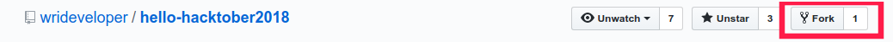

# hello-hacktober2018
Seru seruan hacktoberfest 2018 :checkered_flag:

# What is Hacktoberfest?

[Hacktoberfest](hacktoberfest.digitalocean.com) merupakan program dari Digitalocean dan github dimana kita dapat kaos gratis hanya dengan melakukan 5x pull request di bulan Oktober ke sebuah open source projek di github.

## :pushpin: Syarat mengikut
- Sudah terinstall git
- Bisa dasar git
- Mau belajar

## :scroll: Step mengikuti event

1. Daftarkan akunmu [disini](hacktoberfest.digitalocean.com)

2. Kemudian fork repo ini ya


3. Buat branch baru, jangan pake master ya

4. Kemudian taruh karya terbaik kalian pada folder netizen, dan penamaan folder berdasarkan username kalian.

5. Lakukan Pull Request ke branch master dari repo ini

6. jangan lupa :star2: repo ini dan cantumkan username github kalian di bagian kontributor

## :zap: Tutorial Kilat

### Clone Project
```
git clone https://github.com/{ user name kamu }/hello-hacktober2018.git

cd hello-hactober2018
```

### Buat branch baru
```
git checkout -b branch-baruku
```

### Tambahkan kontibusi kamu
- buat folder baru dengan username kamu dan isi folder dengan projek terbaikmu
- Tambahkan username github pada kontributor dibawah ya

### Commit dan Push
```
git add .
git commit -m "your-commit-msg"
git push origin my-new-branch
```
dan buat Pull Request ke branch master

## :trollface: Kontributor

- [@ffadilaputra](github.com/ffadilaputra)

## :octocat: Organization
